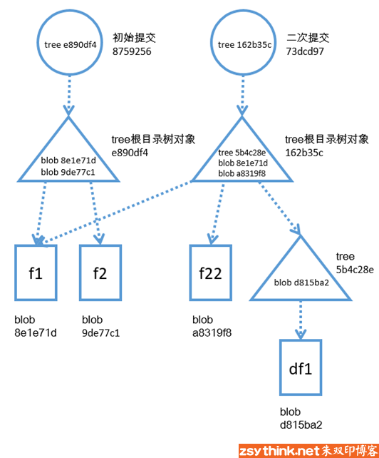
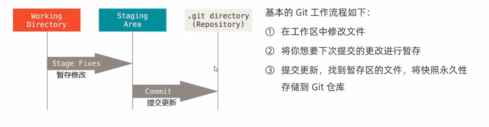
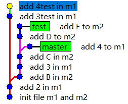

## 仓库

`git init`命令是把当前目录转化成git repo

`git init repo_name` 命令是在当前目录中创建一个以repo_name命名的新目录，新目录是一个git repo


## 作用域

```bash
git config --system  #使对应配置针对系统内所有的用户有效
git config --global #使对应配置针对当前系统用户的所有仓库生效
git config --local #使对应配置只针对当前仓库有效
#local选项设置的优先级最高。
```


## git对象

blob：一个blob就是由一个文件转换而来，blob对象中只会存储文件的数据，而不会存储文件的元数据

tree：由一个目录转化而来，tree对象中只会存储一层目录的信息，它只存储它的**直接文件和直接子目录**的信息，但是子目录中的内容它并不会保存。

commit：一个commit就是一个我们所创建的提交，它指向了一个tree，这个tree保存了某一时刻项目根目录中的直接文件信息和直接目录信息，也就是说，这个tree会指向直接文件的blob对象，并且指向直接子目录的tree对象，子目录的tree对象又指向了子目录中直接文件的blob，以及子目录的直接子目录的tree，依此类推。

每个git对象都有一个哈希码，如果git对象的内容相同，那么他们的哈希码就是相同的。

通过引用/指向的方式指向没有发生改变的状态，所以当我们使用git进行版本管理时，只会牺牲最小的磁盘空间，来实现版本管理。




## git中的三种状态

- 已修改：表示修改了文件，但还没将修改的结果放到**暂存区**
- 已暂存：表示对已修改文件的当前版本做了标记，使之包含在下次提交的列表中
- 已提交：表示文件已经安全地保存在本地的git仓库中

当我们执行”`git add`”命令以后，工作目录中文件的状态就已经转换成blob对象了，这个时候”git add“命令会做两件事：1、为更改的文件新状态创建blob对象；2、更新索引（暂存区），将索引中的原文件指向新创建的blob对象。

然后当我们使用”`git commit`”命令以后，git会根据索引中的结构，在对象库中创建出对应的tree对象，之后，git会创建一个commit对象，并且将新创建的commit对象指向刚才新创建的tree，于是，一个新的提交产生了，它记录了一个状态，所以可以随时通过这个提交回到对应的状态，而且这个时候，索引的结构和最新的提交所对应的结构是一致的。并且这个新创建的提交也会指向前一个提交，每个提交都会指向自己的父提交。

所以基本的git工作流程：



#### 基础命令

```bash
git status #查看工作区的变更，如果希望以精简的形式显示，则加上-s
git add #开始跟踪文件，处于暂存状态
git commit -m "xxx" #提交，xxx为本次的提交信息
git log #查看提交历史
git commit -a -m "提交信息" #将所有已跟踪的文件的更改添加到暂存区，并提交。
```

通过”`git log`“找到最近的提交：

```bash
$ git log --oneline
29b6c36 (HEAD -> master) add file1 and file2
```

从上述信息可以看出，最近的提交的哈希值为29b6c36，再借助`git cat-file`命令获取到哈希对应的**对象类型**：

```bash
$ git cat-file -t 29b6c36
commit
```

而`git cat-file`命令的”-p”选项可以帮助查看**git对象的相关内容**。

```bash
$ git cat-file -p 29b6c36
tree e890df4b61259ae013926f478db558ec0098e2d5
author easily <easilyyzl@outlook.com> 1746347468 +0800
committer easily <easilyyzl@outlook.com> 1746347468 +0800

add file1 and file2
```

#### 删除和重命名

删除testfile文件，并自动将变更暂存，效果相当于在文件系统中删除testfile，然后手动暂存。

```bash
git mv testfile tf
```

将testfile重命名成tf，并自动将变更暂存，效果相当于在文件系统中重命名了

```bash
git mv testfile tf
```


## 分支

分支从本质上就是一些提交所连成的线，当我们需要某些提交与另一些提交之间不会相互影响时，就可以利用分支将它们分开。

```bash
$ git branch #查看本地所有分支
* master
```

使用”`git branch`”命令时还可以加上”-v”参数或”-vv”参数，查看更加详细的分支信息。

假如我们想要创建一个用于测试的名为test的分支，那么可以使用如下命令创建：

```bash
$ git branch test
```

此时，并且从当前的情况来说，test分支和master分支是完全相同的（git只会创建一个test分支指针，并且test分支指针指向master分支对应的最新的提交），但是它们之间却又互不影响

```bash
$ git branch -v
* master 666ddb6 3C
  test   666ddb6 3C
```

再使用“`git checkout`”切换分支：

```bash
$ git checkout test
Switched to branch 'test'
```

#### HEAD

git只要找到HEAD，就能找到我们当前所处的分支（因为我们在切换分支时，会将HEAD指向所在的分支）。

```bash
easily@easilyHhh MINGW64 /e/file/gitdemo/test_repo (test)
$ cat .git/HEAD
ref: refs/heads/test
```

并且：HEAD指针 ——–> 分支指针 ——–> 最新提交

#### 分离头

HEAD不再指向分支，而是直接指向某个commit，即`get checkout commitid`。

```bash
Note: checking out 'cbd3348'.
 
You are in 'detached HEAD' state. You can look around, make experimental
changes and commit them, and you can discard any commits you make in this
state without impacting any branches by performing another checkout.
 
If you want to create a new branch to retain commits you create, you may
do so (now or later) by using -b with the checkout command again. Example:
 
git checkout -b <new-branch-name>
 
HEAD is now at cbd3348 add 2 in m1
```

作用：在分离头的状态下，对当前目录中的文件进行一些实验性的修改，并且将这些实验性的修改创建成一些提交（其实这些提交会组成一条匿名分支），最终可以抛弃这个匿名分支而其他分支不受影响，也可以将这条 匿名分支作为一个新的分支创建来永久性的保存这些提交。



保存分支：

```bash
git checkout -b <new-branch-name>
git branch <new-branch-name> commitid
```

#### 合并分支

当要把A分支合并到B分支时，需要先检出到B分支，然后再执行合并命令将A分支合并进来。merge命令以及常用的一些参数如下：

```bash
git merge A #将A分支合并到当前分支，默认都是先看是否符合ff条件
git merge --no-ff A #将A分支合并到当前分支，但是明确指定不使用”Fast-forward”的模式进行合并
git merge --ff-only A #将A分支合并到当前分支，但是只有在符合”Fast-forward”模式的前提下才能合并成功，在不符合”Fast-forward”模式的前提下，合并操作会自动终止
git merge --no-edit A #使用默认注释：Merge branch ‘BranchName’ 
git merge A --no-ff -m "merge A into master,test merge message" #-m选项对应注释信息
git merge --no-commit A #可以明确指定不自动创建提交，而是手动的创建提交
```

Fast-forward：分叉点以后B分支没有产生了属于自己的提交，则可以直接把B指针指向A的最后一个提交节点上。

不能使用Fast-forward的模式进行合并时，只能使用创建新提交的方法进行合并，且必须为这个新提交填写注释信息。

#### 解决冲突

如果两个分支中的同一个文件中的同一行的内容不一样，当我们合并这两个分支时，就会出现冲突，因为git无法判断我们想要以哪个内容为准，所以需要我们人为介入去确认

1. 放弃合并

   ```bash
   $ git merge --abort
   ```

2. 人为修改冲突文件（此时git bash上的分支会显示成：`(master|MERGING)`，表示合并中），然后add再commit，之后就合并完成了。

#### 删除分支

注意需要先切换到其他分支中

```bash
$ git branch -d new
Deleted branch new (was 7d188a4).
```

强制删除为：`-D`

#### 有关远程

```bash
git branch -r #查看远程所有分支
git branch -a #查看本地和远程的所有分支
```


## 比较差异

查看工作区和暂存区之间的文件差异

```bash
git diff #查看工作区和暂存区之间所有的文件差异
```

查看工作区和仓库（最新提交）之间的文件差异

```bash
git diff HEAD #查看工作区与最新版本库之间的所有的文件差异
git diff commitID #查看工作区与具体某个提交版本之间的所有的文件差异
```

查看暂存区和仓库之间文件的差异

```bash
git diff --cached #查看暂存区和 上一次提交的最新版本(HEAD) 之间的所有文件差异
git diff --cached commitID #查看暂存区和 指定版本 之间的所有文件差异
git diff --cached testbranch #比较暂存区和testbranch分支最新的提交
```

查看不同版本库之间文件的差异

```bash
git diff HEAD~ HEAD #比较当前分支中最新的两个提交之间的差异
git diff 版本号1 版本号2 #查看两个版本之间的差异
git diff 版本号1 版本号2 --stat #查看两个版本之间的改动的文件列表
```

如果要指定某个/些文件，就使用`--`指定文件的路径，文件路径可以有多个，用空格隔开。


## 回退

使用`git reset HEAD`命令可以帮助我们把暂存区恢复到**未暂存任何工作区修改**的状态（即与最新的commit的状态保持一致，但<u>工作区中的内容或者变更不受影响</u>）

```bash
$ git reset HEAD
Unstaged changes after reset:
M       f1
M       f2
```

也可以指定只操作某个文件，比如假设f1和f2的变更都已经同步到了暂存区，而只是想要从暂存区去除f2的变更，f1的变更仍然保留在暂存区中，那么我们可以执行如下命令：

```bash
$ git reset HEAD -- f2
Unstaged changes after reset:
M       f2
```

查看仓库状态：

```bash
$ git status
On branch master
Changes to be committed:
  (use "git restore --staged <file>..." to unstage)
        modified:   f1

Changes not staged for commit:
  (use "git add <file>..." to update what will be committed)
  (use "git restore <file>..." to discard changes in working directory)
        modified:   f2
```

如果要将**所有区域还原到与最新的提交相同的状态**（或者任意一个commitID）

```bash
$ git reset --hard HEAD
HEAD is now at e349e62 init,add f1 and f2
#”HEAD”表示当前分支的最新提交（此处可以把HEAD替换成最新提交的commitID，效果是相同的）
```

如果想要**撤销工作区**的变更：

1. 想撤销的文件已经添加到了暂存区中，并且在那之后又在工作区中进行了新修改，那么`git checkout -- file`命令会将工作区中的最新的变更撤销，将文件的状态还原成上次暂存时的状态
2. 如果暂存区中并没有对应的文件的变更，那么`git checkout -- file`命令会将工作区中的变更撤销，将文件的状态还原成上次提交时的状态。
3. 如果想要一次性将所有工作区的变更全部撤销，也可以仓库的根目录中执行如下命令：`$ git checkout -- ./*`

```bash
$ git status -s
 M f1
 M f2
 
$ git checkout -- f2

$ git status -s
 M f1
```

#### 总结

```bash
#撤销已经添加到暂存区中的修改，即让暂存区与最近的提交保持一致，如下三条命令等效
git reset
git reset HEAD
git reset --mixed HEAD
#也可以针对某些文件撤销暂存区中的修改，命令如下
git reset HEAD -- file1 file2
#撤销所有暂存区和工作区中的所有变更
git reset --hard HEAD
#回退到指定的提交
git reset --hard commitID
#使用如下命令可以撤销工作区中file1文件的相关变更
git checkout -- file1
```


## 远程仓库

将本地的内容推送到远程origin仓库（使用`git remote`命令查看所有远程仓库）中，推送的本地分支名是main（前），远程分支名也是main

```bash
git push origin main:main
```

如果二者同名可以直接使用`git push`，或者使用`git push –all`一次性将所有分支的更新都推送到远程仓库中，但只会在当前分支与上游分支同名的情况下推送当前分支到远程，若当前分支没有对应的上游分支则会推送失败，此时可以使用：

```bash
git push --set-upstream origin new:new #推送本地分支到远程的同时设置本地上游分支的效果
#可以使用-u代替--set-upstream，所以上述命令还可以简写成：
git push -u origin new
```

或者可以分两步来完成上述操作：

step1：先推送本地分支到远程仓库

```bash
git push origin new:new #由于推送的本地分支和对应的远程分支同名，可以简写成：git push origin new
```

step2：手动的将本地new分支的上游分支设置为远程origin仓库中的new分支

```bash
git branch new --set-upstream-to=origin/new
#等价git branch new -u origin/new

#可以省略上述命令中的本地分支名称，当没有指定本地分支名称时，表示默认设置当前分支的上游分支
git branch -u origin/new
```

#### 更新内容

将远程主机的最新内容拉到本地，但是不会更新本地分支中的代码，用户在检查了以后决定是否合并（merge）到工作本机分支中

```bash
git fetch
git fetch <远程主机名>
git fetch <远程主机名> <分支名>

#之后再merge
git merge origin/new
```

或者使用git pull（=fetch+merge），即将远程主机的某个分支的更新取回，并与本地指定的分支合并

```bash
git pull <远程主机名> <远程分支名>:<本地分支名>
#如果远程分支是与当前分支合并，则冒号后面的部分可以省略
git pull origin 远程分支名>
```

而直接使用`git pull`，此命令表示当本地分支与上游分支同名时，**对当前分支执行pull操作，对其他分支执行fetch操作**，具体的差异主要取决于对应的远程分支有没有更新。
