#### wsl+Ubuntu

```bash
wsl --install -d Ubuntu

#迁移到D盘
wsl --export Ubuntu D:\Ubuntu\export.tar
wsl --unregister Ubuntu
wsl --import Ubuntu D:\Ubuntu D:\Ubuntu\export.tar --version 2

#修改默认登录用户
sudo adduser username #创建新普通用户
echo -e "[user]\ndefault=username" | sudo tee /etc/wsl.conf
usermod -aG sudo username
exit

wsl --terminate Ubuntu
wsl -d Ubuntu #之后关闭并重新启动WSL即可
```

#### 安装机器学习框架

conda：是一个开源的包管理和环境管理系统。它支持快速安装、运行和更新软件包及其依赖项，并且可以轻松在本地计算机上创建、保存、加载和切换不同的环境。

CUDA：是一种协助“CPU任务分发+GPU并行处理”的编程模型/平台，用于加速GPU和CPU之间的计算。

CUDA Toolkit与CUDA的关系类似于工具箱与工具的关系。CUDA提供了基础架构和编程模型，而Toolkit提供了一系列工具和库来优化这些程序的开发和执行。例如，使用NVCC可以将CUDA代码编译成GPU可执行的代码。

cudnn：是一个专门为深度学习设计的GPU加速库。它提供了一系列高效的卷积、池化、激活函数等操作，帮助开发者快速实现深度学习模型。

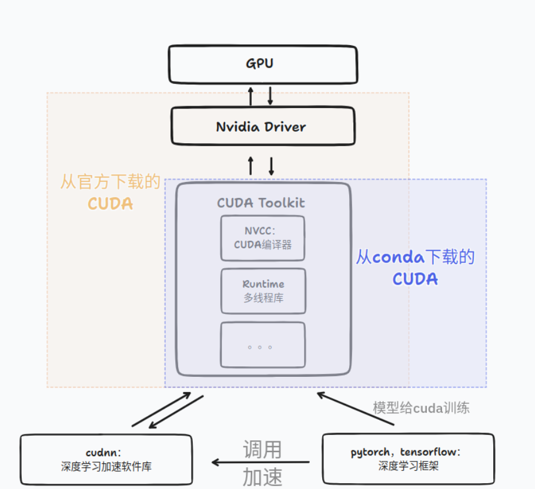


```bash
nvdia-smi
```

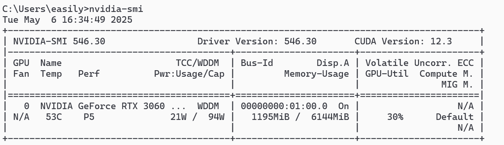

##### cuda&conda

下载安装包

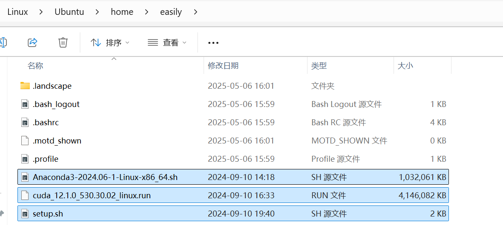

```bash
#安装cuda和conda
sudo chown $USER:$USER *.sh
chmod a+x *.sh
./setup.sh
```

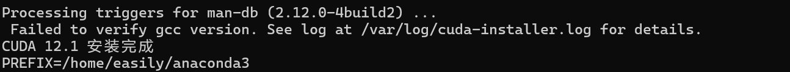

这个地方安装失败并且在usr/local里找不到cuda文件夹，查看日志应该是gcc版本问题（13.3.0）

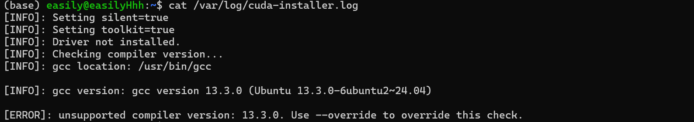

gcc降级：

```0
sudo apt install gcc-11 g++-11
#设置为默认编译器
sudo update-alternatives --install /usr/bin/gcc gcc /usr/bin/gcc-11 110
sudo update-alternatives --install /usr/bin/g++ g++ /usr/bin/g++-11 110
sudo update-alternatives --config gcc  # 选择 gcc-11
sudo update-alternatives --config g++  # 选择 g++-11
#重新安装cuda并配置环境变量
sudo sh cuda_12.1.0_530.30.02_linux.run --toolkit --silent --override
```

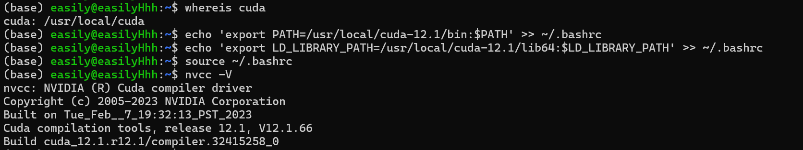

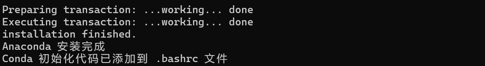

```bash
#激活环境变量
source ~/.bashrc
#创建python运行环境并激活
conda create -n llm python=3.11
conda activate llm
```

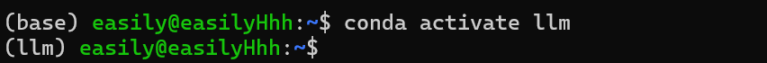

```bash
#安装pytorch
conda install pytorch==2.4.0 torchvision==0.19.0 torchaudio==2.4.0 pytorch-cuda=12.1 -c pytorch -c nvidia
```

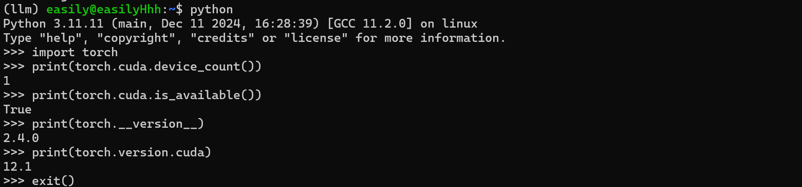

##### 安装cudnn

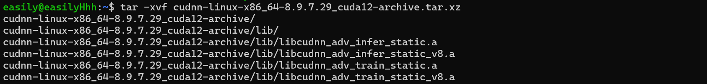

```bash
# 复制文件到 CUDA 目录
sudo cp cudnn-*-archive/include/cudnn*.h /usr/local/cuda-12.1/include/
sudo cp -P cudnn-*-archive/lib/libcudnn* /usr/local/cuda-12.1/lib64/
sudo chmod a+r /usr/local/cuda-12.1/include/cudnn*.h /usr/local/cuda-12.1/lib64/libcudnn*
```

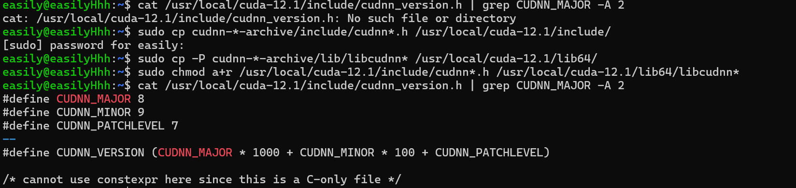